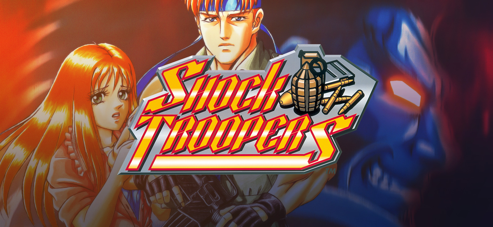
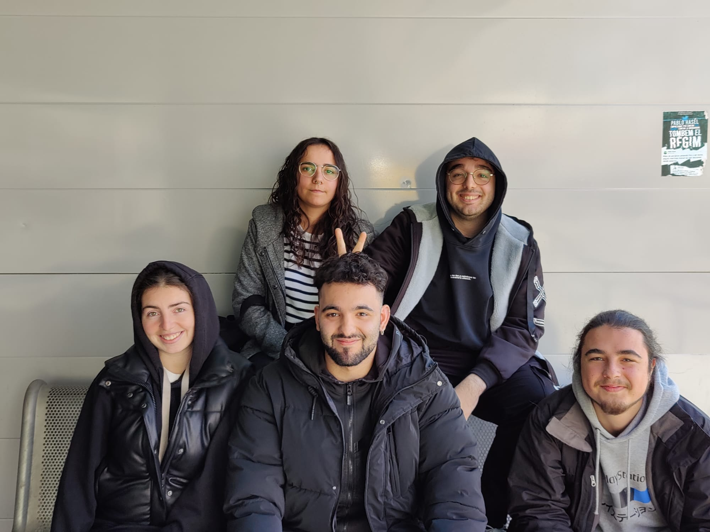

# Project1 Shock Troopers

Shock Troopers is a run-and-gun arcade game developed by Saurus and originally released in 1997. With a top-down perspective, it offers exciting gameplay for up to two players who get to control one of eight skilled mercenaries hired by the government to eliminate a notorious terrorist organization.

The game comprises eight challenging missions, with each level having a distinct objective and culminating in a boss battle. To progress through the missions, players must combat waves of enemies, including soldiers and vehicles, using an arsenal of weapons ranging from guns to grenades. Additionally, each character possesses unique special attacks that enhance the gameplay experience.



## Authors

- [@mdoradom](https://www.github.com/mdoradom)
- [@MiquelAr-GD](https://www.github.com/MiquelAr-GD)
- [@nsortsauquillo](https://www.github.com/nsortsauquillo)
- [@apb8](https://www.github.com/apb8)
- [@martagnarta](https://www.github.com/martagnarta)

## Our Project

We are recreating the 1997 Shock Troopers Game Arcade version as a tribute to the game. Made by CITM UPC Terrassa students.

## Shock Troopers Gameplay

<iframe src="https://www.youtube.com/watch?v=dQw4w9WgXcQ"></iframe>

## Controls

```
    W, A, S, D To move the player
    SPACE to shot
    SHIFT to roll
```

## Team Photo


