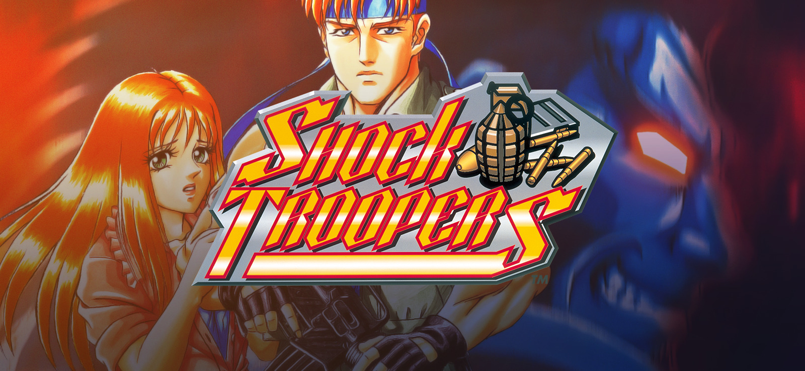
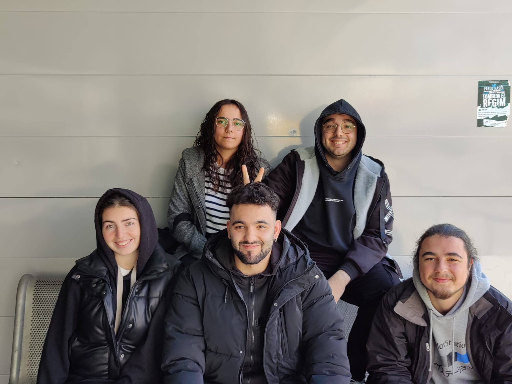

# Project1 Shock Troopers

Shock Troopers is a run-and-gun arcade game developed by Saurus and originally released in 1997. With a top-down perspective, it offers exciting gameplay for up to two players who get to control one of eight skilled mercenaries hired by the government to eliminate a notorious terrorist organization.

The game comprises eight challenging missions, with each level having a distinct objective and culminating in a boss battle. To progress through the missions, players must combat waves of enemies, including soldiers and vehicles, using an arsenal of weapons ranging from guns to grenades. Additionally, each character possesses unique special attacks that enhance the gameplay experience.



## Our Project

We are recreating the 1997 Shock Troopers Game Arcade version as a tribute to the game. Made by UPC CITM Terrassa students.

## Authors

- [@nsortsauquillo](https://www.github.com/nsortsauquillo) (Nicolás Sort Sauquillo)
- [@MiquelAr-GD](https://www.github.com/MiquelAr-GD)       (Miquel Andrés Rodríguez)
- [@martagnarta](https://www.github.com/martagnarta)       (Marta Jover Valero)
- [@mdoradom](https://www.github.com/mdoradom)             (Mario Dorado Martínez)
- [@apb8](https://www.github.com/apb8)                     (Alexia Palacín Bargalló)

Besides the current responsibility, each team member has worked on the game's code and helped/assisted each other on different ambits.

## Nicolás Sort 

Nico has contributed in a diverse and wide assortment of our project's features. His main highlights are the implementation of the gamepad as the primary input method and the implementation of multiple objects and enemies on the map. He has also contributed in other areas such as sprite extraction, management of colliders, bug fixing within others.

## Miquel Andrés

Miquel has contributed in a varied selection of our project's features. His main highlights are the set up and display of the game camera and the implementation of all the necessary colisions to our game's map. He has also contributed in other ambits as in bug fixing in general,  particles, UI, within others.

## Marta Jover

Marta has contributed in a large and diverse selection of our project's features. Her main highlights are all the relatives with our player and main character, Milky, such as the pertinent spritesheet and player logic. She has also contributed in other ambits as UI, Pick-up items, audio effects, and others.

## Mario Dorado

Mario has contributed in a wide range of our project's features. It's main highlights are the implementation of multiple entities's logic, such as the enemies: infantry soldiers, the small tanks, the first boss ( flying battleship), the final boss (Big tank). He has also contributed with a lot of bug fixing, the creation and implementation of several characters's state machine, and others. 

## Alexia Palacín

Alexia has contributed in a varied range of our project's features. Her main highlights are the implementation of multiple animations and adjustments of multiple entities shooting mechanics. She has also contributed in some additions to the UI, sprite extraction, and enemies bug fixing, within others.


## Shock Troopers Gameplay

<iframe width="760" height="515" src="https://www.youtube.com/embed/DSSk5Oo9IO0" title="YouTube video player" frameborder="0" allow="accelerometer; autoplay; clipboard-write; encrypted-media; gyroscope; picture-in-picture; web-share" allowfullscreen></iframe>

## Controls

```
    W, A, S, D To move the player
    SPACE to shot
    SHIFT to roll
    Debug Tools F1
    Debug Menu Info F2
```

## Team Photo


